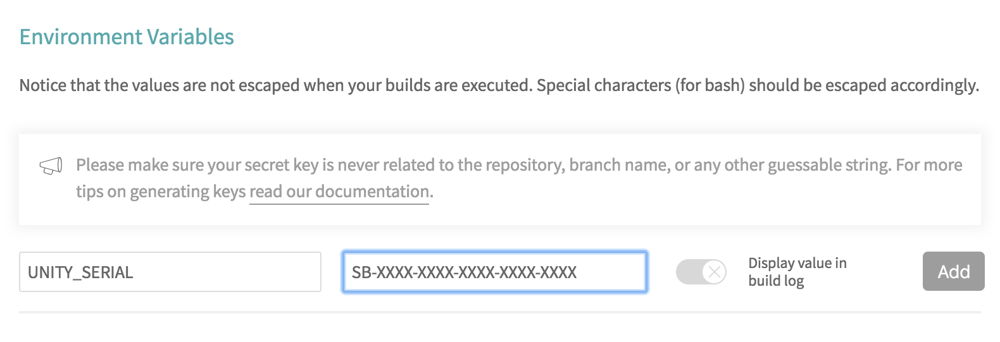
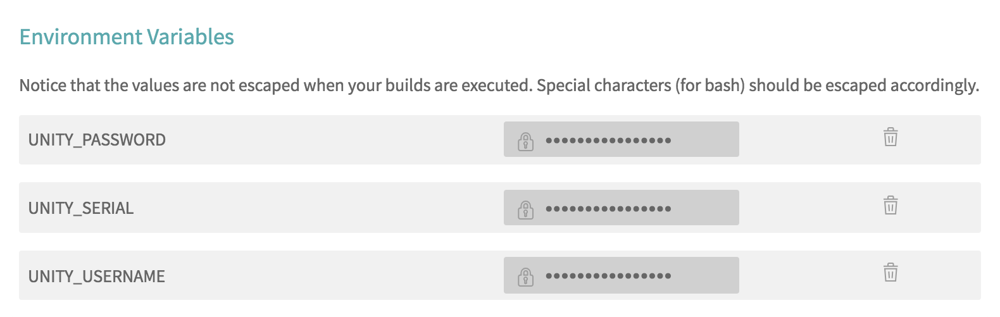

# Unity CI Tools

> Bash scripts for running Unity tests on continuous integration services

[](https://travis-ci.org/neogeek/unity-ci-tools)
[](https://discord.gg/nNtFsfd)
[](hhttps://trello.com/b/b4Tpw4Bw/unity-ci-tools)

## Setup

### Create a `.travis.yml` File

```yaml
sudo: required
language: objective-c
osx_image: xcode9.4.1
rvm:
  - 2.5.1
install:
  - bash <(curl -fsSL https://raw.githubusercontent.com/neogeek/unity-ci-tools/master/bin/install.sh)
script:
  - bash <(curl -fsSL https://raw.githubusercontent.com/neogeek/unity-ci-tools/master/bin/auth.sh)
  - bash <(curl -fsSL https://raw.githubusercontent.com/neogeek/unity-ci-tools/master/bin/test.sh)
  - bash <(curl -fsSL https://raw.githubusercontent.com/neogeek/unity-ci-tools/master/bin/deauth.sh)
```

### Setup Environment Variables on Travis

Add the following variables in the settings panel of your project on <https://travis-ci.org/>:

| Key | Description | Required |
| --- | ----------- | -------- |
| UNITY_INSTALLER_HASH | Hash of editor installer. To be used to version. See [editor installers](data/editor-installers.json). | No |
| UNITY_INSTALLER_VERSION | Version of editor installer. To be used with hash. See [editor installers](data/editor-installers.json). | No |
| UNITY_INSTALLER_URL | Full URL of editor installer. See [editor installers](data/editor-installers.json). | No |
| UNITY_SERIAL | The serial key found at <https://id.unity.com/en/subscriptions>. Keys are only avalible with a Plus or Pro Subscription | Yes |
| UNITY_USERNAME | Your email address used to log into <https://unity.com/>. | Yes |
| UNITY_PASSWORD | Your password used to log into <https://unity.com/>. | Yes |




